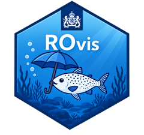
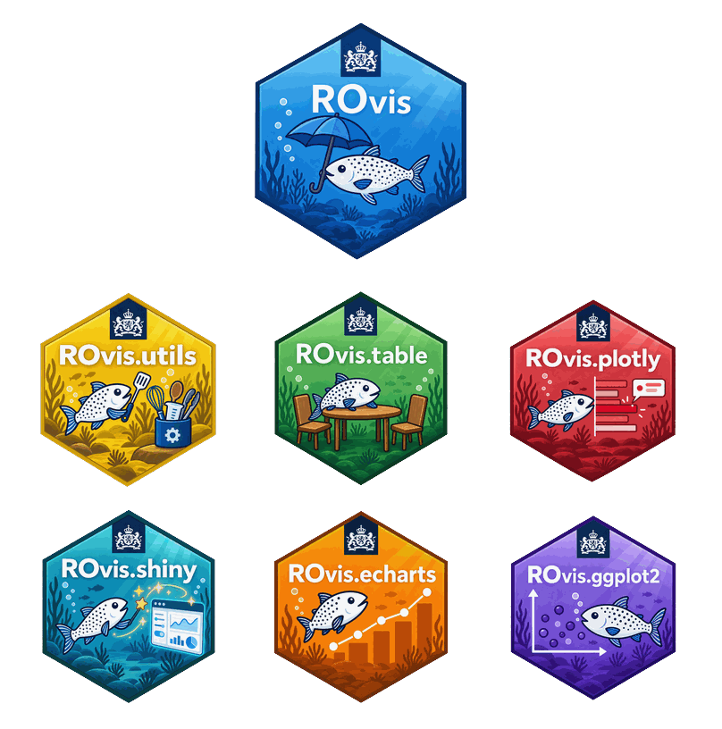

# ROvis <a href="https://github.com/rivm-syso/ROvis"></a>

<!-- badges: start -->
[](https://github.com/rivm-syso/ROvis/actions/workflows/ci.yaml)
[](https://github.com/rivm-syso/ROvis/actions/workflows/ci.yaml)
[](https://github.com/rivm-syso/ROvis/actions/workflows/ci.yaml)
[](#the-family)
<!-- badges: end -->

*Rijksoverheid Visualisatie - umbrella package*

## Why ROvis

Rijksoverheid organisations need visualisations that follow the Rijkshuisstijl and meet
government accessibility requirements (WCAG). This means they need to have the right colors, the right fonts, readable
contrast, screen-reader-friendly output... Getting that right for every chart and table, in
every project, is easy to get wrong and expensive to redo.

ROvis exists so you don't have to solve that. It's a family of R packages that
already gets the house style and accessibility right, so teams can spend their time on the
data and the story instead of re-implementing theming and accessibility from scratch.
`ROvis` itself is an entry point, the "umbrella". If you install it, all the packages in the family are installed as well.

## The family

Meet the `ROvis` family members.

| Package | Role | What it gives you |
|---|---|---|
| [ROvis.utils](https://github.com/rivm-syso/ROvis.utils) | Foundation | Rijkshuisstijl colors, fonts, scales and accessibility helpers shared by every other package |
| [ROvis.ggplot2](https://github.com/rivm-syso/ROvis.ggplot2) | Visualisation | `ggplot2` plots in Rijksoverheid style |
| [ROvis.plotly](https://github.com/rivm-syso/ROvis.plotly) | Visualisation | Interactive `plotly` visualisations in Rijksoverheid style |
| [ROvis.echarts](https://github.com/rivm-syso/ROvis.echarts) | Visualisation | `echarts4r` plots in Rijksoverheid style |
| [ROvis.table](https://github.com/rivm-syso/ROvis.table) | Visualisation | `gt`/`DT` tables in Rijksoverheid style |
| [ROvis.shiny](https://github.com/rivm-syso/ROvis.shiny) | Application | `shiny` UI building blocks, built on `ROvis.table` and `ROvis.plotly` |

<p align="center">
  
</p>

Each package also works standalone if you only need one visualisation library. Install
`ROvis` when you want the whole family available at once.

## Installation

```r
# Install from GitHub
# install.packages("devtools")
devtools::install_github("rivm-syso/ROvis")
```


## Usage

```r
library(ROvis)
```

Loading `ROvis` attaches all six family packages (`ROvis.utils`, `ROvis.table`,
`ROvis.plotly`, `ROvis.shiny`, `ROvis.echarts`, `ROvis.ggplot2`) and prints a startup
message listing each one's version, so you always know exactly what you're working with.

## Support
First point of contact for questions: ROvis team (spin@rivm.nl)

## Roadmap
- **CRAN release for the whole suite.** Until then, install from GitHub: `develop` carries
  the latest work, `main` tracks the last stable release.
- **A consistent first release across the family.** Currently all the family members are in development and are nearly ready for a first (public) release. 

## Contributing
Contributions are welcome! See the Contributing guide and Code of Conduct linked in the
sidebar, and use the issue templates (bug report, feature request, question) when opening
an issue.

`ROvis` itself is just the umbrella: it has no visualisation code of its own, so most
contributions belong in the relevant family repo instead. Check out [the family](#the-family)
above to find the right one.

## Instructions for developers 

For information about R package development, check the [R Packages book](https://r-pkgs.org/). 

Below we describe the most important guidelines for working on `ROvis`.


### Requirements
We use the `testthat`, `lintr` and `roxygen2` package for development of tests, code style 
checks and automatic documentation. We also use the `devtools` and `usethis` package during 
development to adhere to standards for R packages and make developing easier! Install them 
in your Rstudio environment:

```r
install.packages("testthat")
install.packages("lintr")
install.packages("roxygen2")
install.packages("quarto")
install.packages("pkgdown")
install.packages("devtools")
install.packages("usethis")
```

### Guidelines
Type `devtools::load_all()` in your console each time you start developing. This loads 
all dependencies and non-exported functions in the NAMESPACE. This makes developing a lot easier!

To ensure code standardization and quality, follow these guidelines:
- Add tests with `usethis::use_test()`
- Add a new package dependency to the DESCRIPTION file with `usethis::use_package()`. We use 
the `min_version` argument to specify a minimum version. 
- Add a new function dependency to the NAMESPACE with `usethis::use_import_from()`
- Add documentation to new functions by inserting a roxygen skeleton and use `devtools::document()` to
create automatic documentation in the `man` folder

## Authors and acknowledgment
This R packages was created by ROvis team (spin@rivm.nl).

## License
Apache License 2.0 (see the full license linked in the sidebar). The same license applies
across the whole ROvis.* family, so licensing terms stay identical whichever package you
install directly.
